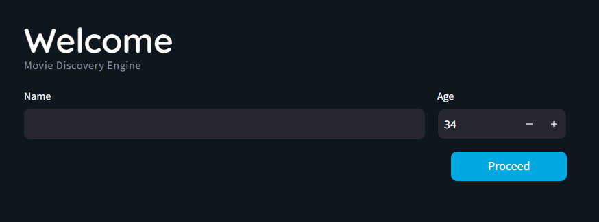
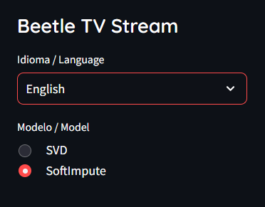

# 🎬 Beetle TV Movie Stream | Matrix Completion Recommender

<p align="center">
  
  
  
  
</p>

### 🚀 **Access the Live Application / Acesse o App / Acceso Directo:**
## **👉 [https://beetletv-movie-recommender.streamlit.app/](https://beetletv-movie-recommender.streamlit.app/)**

---

## 🌎 Choose your language / Seleccione su idioma / Escolha seu idioma

<details>
<summary><b>English (EN-US) 🇺🇸</b></summary>

### 📌 Project Overview
Developed as an academic project during an exchange program at **Universidad de Monterrey (UDEM)**, Beetle TV is a movie recommendation engine based on **Matrix Completion**. Using the MovieLens 100k dataset, the app allows users to interact with collaborative filtering algorithms in real-time.

### 🔬 Technical Core
1. **Interactive Feedback:** Users rate 20 random movies to build an initial profile.
2. **Data Sparsity Management:** Implementation of a popularity filter (>50 ratings) to ensure recommendation quality.
3. **Dual Mathematical Engines:** * **SVD:** Fast matrix factorization for immediate results.
   * **SoftImpute:** Iterative algorithm for high-precision imputation.
4. **Environment Constraints:** Optimized for Streamlit Cloud with specific memory handling.

</details>

<details>
<summary><b>Español (ES-MX) 🇲🇽</b></summary>

### 📌 Descripción del Proyecto
Proyecto desarrollado en la **Universidad de Monterrey (UDEM)** que consiste en un sistema de recomendación de películas basado en **Matrix Completion**. Utilizando el dataset MovieLens 100k, la aplicación permite al usuario experimentar con algoritmos de filtrado colaborativo.

### 📊 Aspectos Técnicos
* **Interfaz Interactiva:** Calificación de 20 películas aleatorias mediante un sistema de estrellas personalizado.
* **Filtro de Popularidad:** Conservación de películas con más de 50 calificaciones para asegurar la confiabilidad.
* **Motores de Cálculo:** Elección entre **SVD** (rapidez) y **SoftImpute** (precisión matemática en datos dispersos).
* **Optimización:** Configurado específicamente para entornos de nube con Python 3.11.

</details>

<details>
<summary><b>Português (PT-BR) 🇧🇷</b></summary>

### 📌 Visão Geral do Projeto
Desenvolvido durante um intercâmbio na **Universidad de Monterrey (UDEM)**, o Beetle TV é um motor de recomendação de filmes baseado em **Matrix Completion**. O sistema utiliza o dataset MovieLens 100k e aplica álgebra linear para prever as preferências do usuário.

### 🔬 Metodologia e Funcionalidades
* **Ciclo de Feedback:** Avaliação de 20 filmes para criar um perfil de preferências em tempo real.
* **Tratamento de Dados:** Filtro de popularidade para remover ruídos e garantir sugestões relevantes.
* **Algoritmos:** Comparação entre **SVD** (decomposição de valor singular) e **SoftImpute** (preenchimento iterativo).
* **UX Customizada:** Interface multi-idioma com design focado na experiência de streaming.

</details>

---

## 🚀 Technical Journey | Trayectoria | Jornada

| Phase | Component | Key Visual | Goal |
| :--- | :--- | :--- | :--- |
| **1. UI Setup** | Streamlit | `beetletv-motor-engine.png` | Personalized user entry and data session initialization. |
| **2. Selection** | Sidebar | `beetletv-menu.png` | Dynamic language switching and mathematical model choice. |
| **3. Filtering** | Pandas Engine | *Code Logic* | Applied threshold of >50 ratings to fix data sparsity. |
| **4. Imputation** | SVD / SoftImpute | *Processing* | Completing the User-Item matrix to predict unknown ratings. |
| **5. Delivery** | Recommendation | *Result UI* | Top 10 movie suggestions based on the predicted scores. |

---

## 🖼️ Visual Tour | Recorrido Visual | Tour Visual

<table align="center">
  <tr>
    <td align="center"><b>1. Welcome & Entry</b><br><br><i>Entry point for personalization.</i></td>
    <td align="center"><b>2. Model Control</b><br><br><i>Engine and Language selection.</i></td>
  </tr>
</table>

---

## 💡 Technical Notes | Notas Técnicas

**EN:** **SoftImpute** is memory-intensive. The app uses a threshold filter and specific model tuning (`max_iters=20`) to maintain stability on Streamlit Cloud. **Python 3.11 is required.**

**ES:** **SoftImpute** consume mucha memoria. La aplicación utiliza un filtro de umbral y ajustes específicos (`max_iters=20`) para mantener la estabilidad. **Se requiere Python 3.11.**

**PT-BR:** O **SoftImpute** exige alto processamento. O app utiliza filtros de popularidade e ajuste de hiperparâmetros (`max_iters=20`) para garantir estabilidade no deploy. **Requer Python 3.11.**

---

## 🛠️ Tech Stack | Stack Tecnológico
- **Python 3.11** (`Streamlit`, `Pandas`, `Numpy`, `Scikit-learn`, `SciPy`, `Fancyimpute`).

## 👤 Author / Autor
**Douglas Barbosa de Oliveira**
* Multiplatform Software Development Student (FATEC/UDEM).
* Career transition to Data and BI.

## ⚙️ Setup
```bash
git clone [https://github.com/douglasbarbosaoliveira/matrix-completion-movie-recommender.git](https://github.com/douglasbarbosaoliveira/matrix-completion-movie-recommender.git)
pip install -r requirements.txt
streamlit run app.py
